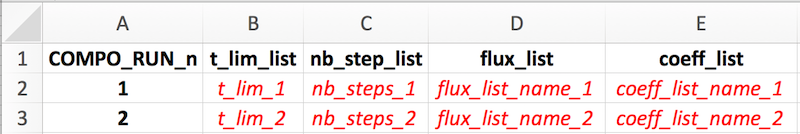
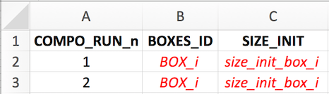
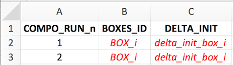
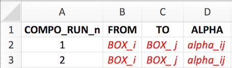
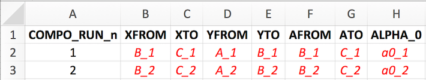

```{r, include = FALSE}
knitr::opts_chunk$set(
  collapse = TRUE,
  comment = "#>"
)
options(rmarkdown.html_vignette.check_title = FALSE)
```

----

[Full documentation and tutorials can be found on the isobxr website.](https://ttacail.github.io/isobxr_web/)

----

# How does **sweep_dyn** work?

The `sweep_dyn` function is designed to allow the user to map the combined effects of two parameters over the dynamic response of an [isobxr](https://ttacail.github.io/isobxr/) box model, 
typically in a system at steady state suddenly facing a perturbation. 

The `sweep_dyn` workflow can be found [here](https://ttacail.github.io/isobxr_web/vgn_08_sweep_dyn.html). 

<!-- It's structure is shown below:  -->

<!-- ```{r echo=FALSE, out.width='75%'} -->
<!-- knitr::include_graphics('./08_dyn_general_principle.png') -->
<!-- ``` -->

The `sweep_dyn` function  is built as a 2 steps composite scenario. 

1. The first run (run #1) is used to force the initial conditions of the second run. It is run repeatedly together with run #2 over the whole space of parameters defined by user. 
1. The second run (run #2) takes system final state of the run #2 as initial state. It is run repeatedly together with run #1 over the whole space of parameters defined by user. 
1. Both runs (#1 and #2) are repeated together for all the combinations of the two parameters values.  
    + Each parameter varies over a range of values defined by the user:  
        - parameter #1 is ranging over *n* values, parameter #2 over *m* values.  
    + Run #1 and #2 are repeated over the whole 2D space of parameters ($n \times m$ times).  

The main purpose of this `sweep_dyn` structure is:

* to explore the influence of a pair of parameters over the dynamic evolution during run #2 of isotope compositions (and box sizes) in all boxes,
* while starting this run #2 from a an initial state defined by run #1 that also depends on the swept parameters
* run #1 typically being for a balanced system, relaxed to it's steady state  

#  Sweep dyn master file (xlsx)

In addition to the global *isobxr master file*, the `sweep_dyn` function
requires a *sweep dyn master file*. 

The *sweep dyn master file* is the (xlsx) document containing all commands
allowing `sweep_dyn` function to compose a scenario of 2 runs. 

The two parameters to be swept over run #1 and #2 are defined by user directly in the function input, in the R console. 

The format of the *sweep dyn master file* is the same as the *compose master file* and the *sweep steady master file*.

It is where the user sets the design of their 2 runs scenario to be swept:

* necessary: define the list of 2 runs composing the scenario (run durations, run resolutions, lists of fluxes, lists of coefficients).  
* optional: define the forcings over one or both runs composing the scenario (FORCING_RAYLEIGH, FORCING_ALPHA, FORCING_DELTA, FORCING_SIZE).  

The format of the *sweep dyn master file* is standardized. 
The user is encouraged to comply with these standards, as described thereafter, 
otherwise there is a high probability for these functions to crash.

### File Name and Location

* The *sweep dyn master file* is an xlsx file.  
* The *sweep dyn master file* name is chosen by user and specified in the `sweep_dyn` function inputs: [*e.g.*, **0_SWEEP_DYN_MASTER.xlsx** ].  
* the *sweep dyn master file* should be stored in the directory in which **isobxr master file** is found, 
    where all runs for this box model system will be performed 
    and where all outputs will be stored in automatically created subdirectories. 
    This directory corresponds to the working directory (*workdir*) used as parameter of the `sweep_dyn` function.

### File structure

The *sweep dyn master file* contains the 5 following sheet strictly named as follows: 

1. **RUN_LIST**: define the list of 2 runs composing the sweep dyn scenario (run durations, run resolutions, lists of fluxes, lists of coefficients).  
1. **FORCING_RAYLEIGH**: define Rayleigh forcings over one or several runs composing the sweep 2 steps scenario.  
1. **FORCING_ALPHA**: define Rayleigh forcings over one or several runs composing the sweep 2 steps scenario.  
1. **FORCING_DELTA**: define initial delta forcings over one or several runs composing the sweep 2 steps scenario.  
1. **FORCING_SIZE**: define initial box size forcings over one or several runs composing the sweep 2 steps scenario.  

### **RUN_LIST** sheet *(REQUIRED)*
```{r echo=FALSE, out.width='75%'}

```

The `sweep_dyn` function strictly requires a list of *2* successive runs.

Both of these runs should be successively described one by one on two rows of this sheet, with notably:  

1. the run number (COMPO_RUN_n column)  
1. the run duration (t_lim_list column)  
1. the run resolution (nb_steps_list)  
1. the flux list name (flux_list) that will be read from **isobxr master file**  
1. the coefficients list name (coeff_list) that will be read from **isobxr master file**  

### **FORCING_SIZE** sheet *(OPT)*
```{r echo=FALSE, out.width='50%'}

```

See *composite master file* format description for details.

### **FORCING_DELTA** sheet *(OPT)*
```{r echo=FALSE, out.width='50%'}

```

See *composite master file* format description for details.

### **FORCING_ALPHA** sheet *(OPT)*
```{r echo=FALSE, out.width='50%'}

```

See *composite master file* format description for details.

### **FORCING_RAYLEIGH** sheet *(OPT)*
```{r echo=FALSE, out.width='75%'}

```

See *composite master file* format description for details.

#  Using **sweep_dyn**

## Preparing *sweep dyn master*

The user needs to define the two runs composing the 2 steps scenario. 

1. The first run is typically used to let the system relax to its steady state used as an initial state in run #2.  
    i) The user should consider here a balanced system. The [isobxr](https://ttacail.github.io/isobxr/) functions will thus use the analytical solver (`ana_slvr`).
    i) We thus recommend the user to set the number of steps for run #1 (nb_steps) to 1 (its' minimum value).  
        This allows to only calculate the final state of the system, at the end of run #1.  
        This reduces the calculation time and data produced without affecting the accuracy of the calculation.  

1. The second run is used to explore the dynamic response of the system in the face of a given **perturbation**, as a function of all combinations of parameters #1 and #2 values. 
    i) The main purpose of this function is to explore the influence of the 2 combined parameters over the time dependent response of a system that previously relaxed to it's steady state. 
    i) The user has the choice to define a balanced or an unbalanced system in the run #2. 
        A. The latter case (unbalanced system) could here constitute the perturbation of the system. The `sweep_dyn` function will here numerically solve the run #2 (`num_slvr`).
        A. In the case of a balanced system for run #2, the `sweep_dyn` function will analytically solve the run #2 (`ana_slvr`). 
        A. The user should here be aware that the sweeping of the space of parameters using either the `num_slvr` or `ana_slvr` can be time consuming and require a fair bit of calculating power.  
            The user is advised to wisely define the space of parameters (which will define the number of $n \times m$ iterations) as well as the run resolution of run #2 (nb_steps).

**remark**  
:    The reason why the `sweep_dyn` function sweeps both initial run #1 and run #2 
    is that the user might want to sweep parameters that are actually affecting the steady state of the system (e.g., sweep a series of lists of fluxes or coefficients). 
    
**Forcings**   
:    The user can define some forcings over the system (will affect both run #1 and run #2).  
    These forcings will overwrite the conditions set by the reading of the *isobxr master file*.  
    These forcings will be overwritten by the swept parameters that affect run #1 and #2.

## Required arguments

In addition to all the usual input parameters required for the `sweep_dyn` function, the user has to define the two parameters to be swept.

There are 6 types of sweepable parameters (or that can be explored), which names are strictly defined as follows:

```{r echo=FALSE}
# explore a series of flux lists as defined in isobxr master file
"EXPLO_n_FLUX_MATRICES" 

# explore a series of coeff lists as defined in isobxr master file
"EXPLO_n_ALPHA_MATRICES" 

# explore a vector of sizes for a given box 
"EXPLO_1_SIZE" 

# explore a vector of delta values for a given box 
"EXPLO_1_DELTA" 

# explore a vector of alpha (coeff) values for a given flux
"EXPLO_1_ALPHA" 

# explore a vector of incremental alpha values for a Rayleigh distillation model
"EXPLO_1_RAYLEIGH_ALPHA" 

```

### **EXPLO_n_FLUX_MATRICES**

This type of parameter allows to explore two series of flux lists as defined in *isobxr master file*, one for run #1 and one for run #2.

```{r echo=TRUE, results = "hide"}
data.frame(VALUES_1 = c("flux_list_1",  # RUN #1 vector of n strings of chars.
                        "...", 
                        "flux_list_i", 
                        "...", 
                        "flux_list_n"),  
           VALUES_2 = c("flux_list_1",  # RUN #2 vector of n strings of chars.
                        "...", 
                        "flux_list_i", 
                        "...", 
                        "flux_list_n"),  
           EXPLO_TYPES = "EXPLO_n_FLUX_MATRICES") # stricly leave as such

```

The **EXPLO_n_FLUX_MATRICES** parameter will allow the `sweep_dyn` function to sweep the effect 
of two series of flux lists 
(defining flux matrices and initial box sizes) on run #1 and run #2 evolutions.

The format of this data frame should be exactly as shown above. 

The values are two vectors of strings of characters containing the list of flux list names, 
that will be called from the *isobxr master file*.

### **EXPLO_n_ALPHA_MATRICES**

This type of parameter allows to explore two series of lists of coefficients as defined in *isobxr master file*, one for run #1 and one for run #2.

```{r echo=TRUE, results = "hide"}
data.frame(VALUES_1 = c("coeff_list_1", # RUN #1 vector of n strings of chars.
                        "...", 
                        "coeff_list_i", 
                        "...", 
                        "coeff_list_n"), 
           VALUES_2 = c("coeff_list_1", # RUN #2 vector of n strings of chars.
                        "...", 
                        "coeff_list_i", 
                        "...", 
                        "coeff_list_n"), 
           EXPLO_TYPES = "EXPLO_n_ALPHA_MATRICES") # stricly leave as such


```

The **EXPLO_n_ALPHA_MATRICES** parameter will allow the `sweep_dyn` function to sweep the effect 
of two series of isotope fractionation coefficient lists 
(defining coefficient matrices) on run #1 and run #2 evolutions.

The format of this data frame should be exactly as shown above. 

The values are two vectors of strings of characters containing the list of coefficients list names, 
that will be called from the *isobxr master file*.

### **EXPLO_1_SIZE**

This type of parameter allows to explore a range of sizes for a given box over both run #1 and run #2.

This parameter should be used only in the case where RUN #1 is balanced since it sets the initial box size for each run initial condition.

```{r echo=TRUE, results = "hide"}
data.frame(BOXES_ID = "BOX_i", # 1 string of char
           SIZE_MIN = "min_sweep_value", # 1 numerical value
           SIZE_MAX = "max_sweep_value", # 1 numerical value
           SIZE_STEPS = "sweep_steps", # 1 numerical value
           EXPLO_TYPES = "EXPLO_1_SIZE") # stricly leave as such


```

The **EXPLO_1_SIZE** parameter will allow the `sweep_dyn` function to sweep the effect of a range of box sizes for a given box
on run #1 and #2 evolution.

The format of this data frame should be exactly as shown above. 

### **EXPLO_1_DELTA**

This type of parameter allows to explore a range of delta values for a given box over both run #1 and run #2.

This parameter should be used only for source boxes, since it will force the initial isotope composition of this box for both run #1 and run #2.

```{r echo=TRUE, results = "hide"}
data.frame(BOXES_ID = "BOX_i", # 1 string of char
           DELTA_MIN = "min_sweep_value", # 1 numerical value
           DELTA_MAX = "max_sweep_value", # 1 numerical value
           DELTA_STEPS = "sweep_steps", # 1 numerical value
           EXPLO_TYPES = "EXPLO_1_DELTA") # stricly leave as such


```

### **EXPLO_1_ALPHA**

This type of parameter allows to explore a range of alpha (coeff) values for a given flux over both run #1 and run #2.

```{r echo=TRUE, results = "hide"}
data.frame(FROM = "BOX_i", # 1 string of char
           TO = "BOX_j", # 1 string of char
           ALPHA_MIN = "min_sweep_value", # 1 numerical value
           ALPHA_MAX = "max_sweep_value", # 1 numerical value
           ALPHA_STEPS = "sweep_steps", # 1 numerical value
           EXPLO_TYPES = "EXPLO_1_ALPHA") # stricly leave as such


```

### **EXPLO_1_RAYLEIGH_ALPHA**

This type of parameter allows to explore a range of incremental alpha values for a Rayleigh distillation model for both run #1 and run #2. 
It is calculated for each run using the run's local flux configuration.

```{r echo=TRUE, results = "hide"}
data.frame(XFROM = "Box_B", # B>C flux at numerator (strings of char)
           XTO = "Box_C",
           YFROM = "Box_A", # A>B flux at denominator (strings of char)
           YTO = "Box_B",
           AFROM = "Box_B", # resulting fract. coefficient (strings of char)
           ATO = "Box_C",
           ALPHA_0_MIN = "min_sweep_value", # value of incremental B>A coeff. (num.)
           ALPHA_0_MAX = "max_sweep_value", 
           ALPHA_0_STEPS = "sweep_steps",
           EXPLO_TYPES = "EXPLO_1_RAYLEIGH_ALPHA") # stricly leave as such


```


******************************************************

## Default and optional outputs
By default, the `sweep_dyn` prints in the R session a series of default time evolution plots of the delta values of each system finite boxes in the 2D space of parameters. 

All `sweep_dyn` output data is stored in a temporary directory by default.

The user can save these outputs to their working directory by changing the **save_run_outputs** argument to **TRUE**.

The `sweep_dyn` outputs are structured as as shown in the [full package documentation.](https://ttacail.github.io/isobxr_web/vgn_08_sweep_dyn.html#33_Default_and_optional_outputs).

<!-- The `sweep_dyn` outputs are structured as follows: -->

<!-- ```{r echo=FALSE, out.width='100%'} -->
<!-- knitr::include_graphics('./08_dyn_outdir.png') -->
<!-- ``` -->

## Plotting **sweep_dyn** outputs

By default, the `sweep_dyn`  prints in the R session a series of default heatmap plots of the delta values of each system finite boxes at the final state of the run in the 2D space of parameters. 

The outputs of the `sweep_dyn` can be plotted using the `shinobxr_app` function.

The `shinobxr_app` function launches an interactive html app allowing to edit and export graphical representation of the model runs.

The `shinobxr_app` requires the user to save the `sweep_dyn` output files to a local working directory (by setting the argument **save_run_outputs = TRUE**).

More on the use of the `shinobxr_app` function can be found on the [Shiny app page](https://ttacail.github.io/isobxr_web/vgn_09_runShinyPlots.html). 

# Tutorial example

Dynamic sweeping of the size of box B and one fractionation coefficient in a 3-boxes balanced open system after a change in the source isotope composition.

Both run #1 and run #2 are performed with the *a1* coefficients list, the *Fx3_ABC_open_bal* flux list and the sweeping parameters. 

The system faces a perturbation: the source isotope composition is shifted from 0 to -1 ‰ using the FORCING_DELTA sheet of the *sweeping dynamic master file*.

Here: 

* using the *sweep dynamic master file* provided for demonstration (0_EXPLO_DYN_MASTER.xlsx)  
* we perform a sweep of the box B size values and $\alpha _{A \to C}$ values  
* during the first 1000 days of run #2  
* starting from a run #1 at steady state obtained by the relaxation of the system 

No forcings other than the FORCING_DELTA on the SOURCE box are applied. 

To do so, the `sweep_dyn` function can be used as follows: 

```{r eval=FALSE, include=TRUE}
sweep_dyn(workdir = "/Users/username/Documents/1_ABC_tutorial", 
          # name of the series ID
          SERIES_ID = "ABC_change_source_sweep_dyn_demo1", 
          # in/out time units for pdf plots
          time_units = c("d", "yr"), 
          # name of sweep dyn master file
          EXPLO_MASTER = "0_SWEEP_DYN_MASTER.xlsx",
          # make alpha A to C vary between 0.9988 and 1
          EXPLO_AXIS_1 = data.frame(FROM = c("A"), 
                                    TO = c("C"),
                                    ALPHA_MIN = 0.9988,
                                    ALPHA_MAX = 1,
                                    ALPHA_STEPS = 0.0004,
                                    EXPLO_TYPES = "EXPLO_1_ALPHA"),
           # make size of B vary between 500 and 4000
          EXPLO_AXIS_2 =  data.frame(BOXES_ID = c("B"),
                                     SIZE_MIN = 500,
                                     SIZE_MAX = 4000,
                                     SIZE_STEPS = 500,
                                     EXPLO_TYPES = "EXPLO_1_SIZE"),
          to_DYN_DIGEST_CSVs = TRUE)
```


The `sweep_dyn` will prompt a question to user checking if the number of iterative runs is validated. The higher this number is the longer the run is. 

This run will produce a series of time evolution plots of the delta values of each system finite boxes in the 2D space of parameters. 

<!-- It will yield for example the following plot for the box C.  -->

<!-- ```{r echo=FALSE, out.width='100%'} -->
<!-- knitr::include_graphics('./img/08_dyn_z_box_C_map.png') -->
<!-- ``` -->

You can explore the outputs by then using the [isobxr](https://ttacail.github.io/isobxr/) Shiny app (`shinobxr_app` function, presented below).

************************************************
